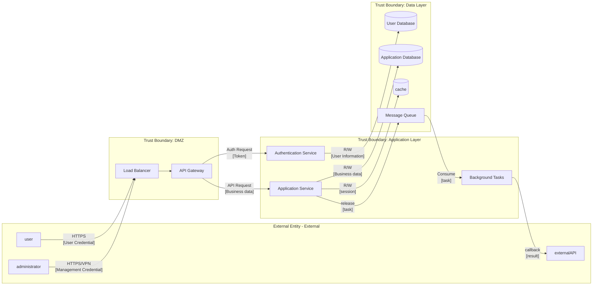

<!-- Code-First Deep Threat Modeling Workflow | Version 2.1.1 | https://github.com/fr33d3m0n/skill-threat-modeling | License: BSD-3-Clause | Welcome to cite but please retain all sources and declarations -->

# Code-First Deep Risk Analysis Workflow

Detailed 8-phase workflow guide for comprehensive code-first threat modeling.

## Workflow Overview

```
┌─────────────────────────────────────────────────────────────────────────────────────────┐
│ 8-Phase Deep Threat Modeling │
├─────────────────────────────────────────────────────────────────────────────────────────┤
│ │
│ Phase 1 ──► Phase 2 ──► Phase 3 ──► Phase 4 ──► Phase 5 ──► Phase 6 ──► Phase 7 ──► Phase 8 │
│ Project Call Flow Trust Security STRIDE Risk Mitigation Report │
│ Understanding DFD Boundaries Design Analysis Validation │
│ │
│ ┌────────────────────────────────────────────────────────────────────────────────────┐ │
│ │ serialexecute + outputpass │ │
│ │ │ │
│ │ Phase N Output ────────────────────────────────────────────► Phase N+1 Input │ │
│ │ │ │
│ │ Each phase ends: in-depth analysis ──► summary ──► reflection ──► confirm ──► next phase │ │
│ └────────────────────────────────────────────────────────────────────────────────────┘ │
│ │
└─────────────────────────────────────────────────────────────────────────────────────────┘
```

**Execution Rules**:
1. **Strict Serial Execution**: Phases 1→2→3→4→5→6→7→8, no skipping or reordering
2. **Output Propagation**: Each phase receives previous phase outputs as input
3. **Reflection Checkpoints**: Summary and reflection after each phase
4. **Deep Thinking**: All phases use `<ultrathink><critical thinking>` mode
5. **KB Integration**: Phases 5/6/7 must query knowledge base for each risk
6. **Parallel Sub-Agents**: Multi-risk analysis within phases can parallelize

---

## Phase 1: Project Understanding <ultrathink><critical thinking>

**Goal**: Comprehensively understand the project's architecture, features, modules, and security-relevant design.

### Steps

1. **Get file structure**
 ```bash
 python scripts/list_files.py <project-path> --categorize --detect-type --pretty
 ```

2. **Identify project type** from script output:
 - Web application (React, Vue, Angular, Next.js)
 - Backend API (Express, FastAPI, Spring Boot, Django)
 - Microservices (multiple services, Docker, Kubernetes)
 - AI/LLM application (model loading, inference, RAG)
 - Hybrid (combination of above)

3. **Collect Project Scale Metrics**:
 Use code analysis tools to gather quantitative project metrics:
 ```bash
 # Option 1: Using cloc (recommended)
 cloc <project-path> --json --quiet

 # Option 2: Using tokei
 tokei <project-path> --output json

 # Option 3: Manual collection
 find <project-path> -type f -name "*.py" | wc -l # file count
 find <project-path> -type f -name "*.py" -exec cat {} + | wc -l # LOC
 ```

 Collect these metrics:
 - **Total LOC** (Lines of Code, excluding blanks/comments)
 - **File count** by language
 - **Directory count** (code directories)
 - **Module count** (top-level functional modules)
 - **Dependency count** (from package manifests)
 - **Language distribution** (percentage by language)

4. **Read key files** (priority order):
 - Entry points: `main.py`, `app.py`, `index.js`, `server.js`
 - Config files: `config/`, `.env.example`, `settings.py`
 - API definitions: `routes/`, `api/`, `controllers/`
 - Package manifests: `package.json`, `requirements.txt`, `go.mod`
 - Security config: auth middleware, CORS settings, security headers

5. **Document architecture understanding**:
 - Core functionality and business logic
 - User roles and access patterns
 - External service integrations
 - Data sensitivity classification

### Required Output Template

```markdown
## Project Overview

**Project Type**: [Web App | API | Microservice | AI/LLM | hybrid]
**Primary Language**: [Language]
**framework**: [Framework list]
**Deployment Method**: [Cloud/On-premise/Hybrid]

## Project Scale Metrics

### Code Statistics
| indicator | Value | description |------|------|------| **Total Lines of Code** | [N] | without blank lines andcomment | **filetotal** | [N] | sourcecodefile | **directory count** | [N] | codedirectory | **Main module count** | [N] | Top-level functional modules | **dependentquantity** | [N] | directdependent |

### Language Distribution
| language | Files | Lines of Code | Percentage |------|--------|---------|------| [Language 1] | [N] | [N] | [N]% | [Language 2] | [N] | [N] | [N]% | [Language N] | [N] | [N] | [N]% |

### Security-Related Module Statistics
| Module Type | path | Files | LOC | Security Level |---------|------|--------|------|---------| authentication/authorization | src/auth/ | [N] | [N] | high | encrypt/key | src/crypto/ | [N] | [N] | high | Data access | src/models/ | [N] | [N] | high | APIinterface | src/api/ | [N] | [N] | medium | configuremanage | config/ | [N] | [N] | medium |

## Function Description

### Core functionality
1. [Function 1]: [description]
2. [Function 2]: [description]
3. [Function N]: [description]

### User Roles
| role | Permission Level | Accessible Resources |------|---------|-----------| Anonymous User | low | publicAPI | Registered User | medium | personal data | administrator | high | All Data |

## Main Modules

| module | Responsibility | location | Security Relevance |------|------|------|-----------| Authentication Module | User authentication | src/auth/ | high | API Layer | Request processing | src/api/ | high | Data Layer | Data access | src/models/ | high | business logic | Core functionality | src/services/ | medium |

## Critical Security Design

### Authentication Mechanism
- Authentication Method: [JWT/Session/OAuth2]
- Password Policy: [have/none/partial]
- MFA Support: [have/none]

### Data Storage
- primary database: [type]
- sensitive Data Encryption: [have/none/partial]
- Backup Mechanism: [have/none]

### External Integrations
| service | Purpose | Authentication Method | data exchange |------|------|---------|---------| [Service Name] | [Purpose] | [API Key/OAuth] | [Data Type] |

### Preliminary Security Observations
- Strengths: [...]
- Potential Issues: [...]
```

### Checkpoint

Before proceeding to Phase 2, verify:
- [ ] Project type clearly identified
- [ ] **Project scale metrics collected** (LOC, files, Language Distribution)
- [ ] All entry points located
- [ ] Key modules documented with security relevance
- [ ] Technology stack fully understood
- [ ] External integrations mapped
- [ ] Initial security observations noted

**Reflection**: Summarize key findings and security-relevant insights. Note any areas requiring deeper investigation.

---

## Phase 2: Call Flow & DFD Analysis <ultrathink><critical thinking>

**Goal**: Build comprehensive Data Flow Diagram by tracing how data moves through the system.

**Must Use**: Phase 1 output (project overview, modules, integrations)

### Steps

1. **Identify External Interactors**
 From Phase 1 user roles and integrations:
 - Human users (web, mobile, API clients)
 - External services (payment, auth, third-party APIs)
 - Scheduled jobs, Message Queues
 - Admin interfaces

2. **Trace Data Entry Points**
 For each external interactor:
 ```
 External Interactor → [Entry Point] → Process → Storage
 ```
 Look for:
 - HTTP handlers (`@app.route`, `router.get`, `@GetMapping`)
 - Message consumers (`@consumer`, `subscribe`, `on_message`)
 - File uploads, webhooks, WebSocket handlers

3. **Map Processes**
 For each entry point, trace the call flow:
 - What functions process the data?
 - What transformations occur?
 - What validations are performed?
 - Where does data branch or merge?

4. **Identify Data Stores**
 - Primary databases (SQL, NoSQL)
 - Caches (Redis, Memcached)
 - File storage (S3, local filesystem)
 - Session stores, temp files
 - Logs and audit trails

5. **Draw DFD using Mermaid**

### DFD Template



### Element Inventory Template

```markdown
## DFD Element Inventory

### External Entity (External Interactors)
| ID | Name | type | Sent Data | Received Data |----|------|------|---------|---------| EI1 | user | human | credential, API Request | responsedata | EI2 | administrator | human | managecommand | managedata | EI3 | externalAPI | system | callback data | API Request |

### process (Processes)
| ID | Name | function | Auth Required | Authz Required |----|------|------|---------|---------| P1 | API Gateway | requestrouting | yes | partial | P2 | Authentication Service | Identity validation | no | no | P3 | Application Service | business logic | yes | yes | P4 | Background Tasks | Async Processing | system | system |

### Data Storage (Data Stores)
| ID | Name | type | sensitivity | encrypt | backup |----|------|------|--------|------|------| DS1 | User Database | PostgreSQL | high(PII) | yes | yes | DS2 | Application Database | MongoDB | medium | partial | yes | DS3 | cache | Redis | medium(session) | no | no |

### data flow (Data Flows)
| ID | from | to | data | protocol | encrypt |----|-----|-----|------|------|------| DF1 | EI1 | P1 | userrequest | HTTPS | yes | DF2 | P1 | P2 | Auth Request | gRPC | yes | DF3 | P2 | DS1 | User query | TCP | yes | DF4 | P3 | DS2 | Business data | TCP | partial |
```

### Checkpoint

Before proceeding to Phase 3, verify:
- [ ] All external interactors identified
- [ ] All processes mapped with their functions
- [ ] All data stores documented with sensitivity
- [ ] All data flows traced with protocols
- [ ] DFD diagram complete and accurate
- [ ] Element inventory complete

**Reflection**: Review DFD for completeness. Identify high-risk data flows (sensitive data, cross-boundary).

---

## Phase 3: Trust Boundary Evaluation <ultrathink><critical thinking>

**Goal**: Based on Phase 2 DFD, identify key interfaces, boundaries, data nodes and analyze current security posture.

**Must Use**: Phase 2 output (DFD diagram, element inventory)

### Steps

1. **Identify Network Boundaries**
 From Phase 2 DFD, mark:
 - Internet-facing components (DMZ)
 - Internal network segments
 - Database tier isolation
 - Third-party integration points

2. **Identify Process Boundaries**
 - Container boundaries (Docker, Kubernetes pods)
 - VM/Host boundaries
 - Serverless function isolation
 - Microservice boundaries

3. **Identify User Trust Levels**
 From Phase 1 user roles:
 - Anonymous users (no authentication)
 - Authenticated users (verified identity)
 - Privileged users (admin, operators)
 - System accounts (service principals)

4. **Mark Critical Cross-Boundary Flows**
 High-priority analysis targets:
 - Internet → DMZ
 - DMZ → Application tier
 - Application → Database tier
 - Internal → External services

5. **Analyze Security at Each Boundary**
 For each boundary crossing, document:
 - Current security controls
 - Data exposed
 - Potential risks

### Key Interfaces Analysis Template

```markdown
## Critical Interface Analysis

### Interface Inventory
| Interface ID | Name | type | Source Boundary | Target Boundary | protocol |--------|------|------|--------|---------|------| IF1 | userAPI | HTTP | Internet | DMZ | HTTPS | IF2 | internalRPC | gRPC | DMZ | Application | mTLS | IF3 | databaseconnect | TCP | Application | Data | TLS | IF4 | externalcallback | HTTP | Application | External | HTTPS |

### Interface Security Assessment
| Interface ID | Current Security Controls | assessment | Potential Risk |--------|-------------|------|---------| IF1 | WAF, Rate Limit, JWT | Good | Token hijacking | IF2 | mTLS, serviceauthentication | Good | Certificate management | IF3 | username/Password, Network Isolation | Average | Credential leakage | IF4 | API Key, IP Whitelist | Average | Key disclosure |
```

### Trust Boundary Template

```markdown
## Trust Boundaryanalysis

### Boundary Inventory
| boundary | type | Components | Protection Mechanism | assessment |------|------|---------|---------|------| Internet Edge | network | Load Balancer | WAF, DDoS Protection, TLS | Strong | DMZ | network | API Gateway, Authentication Service | Firewall, Intrusion Detection | Strong | Application | process | Application Service, Background Tasks | mTLS, RBAC | medium | Data | network | database, cache | Network Isolation, encrypt | medium |

### Cross-Boundary Data Flow (High Priority)
| flowID | From Boundary | To Boundary | Data Sensitivity | Risk Level | Current Controls |------|--------|--------|-----------|---------|---------| DF1 | Internet | DMZ | high(credential) | high | TLS, validation | DF3 | DMZ | Application | medium | medium | mTLS | DF5 | Application | Data | high(PII) | high | encryptconnect |
```

### Key Data Nodes Template

```markdown
## Critical Data Nodes

### Data Node Analysis
| node | Stored Data | sensitivity | Encryption Status | Access Control | backup |------|---------|--------|---------|---------|------| UserDB | User PII, Password Hash | high | In-Transit+storage | RBAC | Daily | AppDB | Business data | medium | In-Transit | applylevel | Daily | Cache | Session Token | high | none | Network Isolation | none | Logs | Audit Logs | medium | In-Transit | Read-Only | Long-Term |

### Data Node Risk Assessment
| node | Identified Risks | Current Mitigations | gap |------|-----------|---------|------| Cache | Session hijacking | Expiration time | No encryption | Logs | Sensitive data leakage | Sanitization | Partial coverage |
```

### Checkpoint

Before proceeding to Phase 4, verify:
- [ ] All network boundaries identified
- [ ] All process boundaries identified
- [ ] User trust levels defined
- [ ] Key interfaces documented with security assessment
- [ ] Cross-boundary flows marked with risk levels
- [ ] Key data nodes analyzed

**Reflection**: Summarize boundary security posture. Identify weak boundaries and high-risk crossings.

---

## Phase 4: Security Design Assessment <ultrathink><critical thinking>

**Goal**: Based on Phases 1-3, perform deep analysis of security design across all domains.

**Must Use**:
- Phase 1: Project overview, modules, security design
- Phase 2: DFD, data flows, processes
- Phase 3: Boundaries, interfaces, data nodes

### Security Domains (Must Cover All)

1. **Identity Management (Identity Management)**
2. **authentication (Authentication)**
3. **authorization/Access Control (Authorization/Access Control)**
4. **Encryption & Key Management (Encryption & Key Management)**
5. **Logging & Audit (Logging & Audit)**
6. **Sensitive Data Protection (Sensitive Data Protection)**
7. **High Availability (High Availability)**
8. **Input Validation (Input Validation)**
9. **Session Management (Session Management)**

### Security Assessment Template

```markdown
## Security Design Assessment Matrix

### 1. Identity Management
| Control Point | Current Implementation | assessment | gap |--------|---------|------|------| User registration | Email validation | ✓ | - | Identity validation source | local + OAuth | ✓ | - | Identity lifecycle | Manual management | △ | No automation | Privileged Account Management | No special handling | ✗ | Need PAM |

### 2. authentication
| Control Point | Current Implementation | assessment | gap |--------|---------|------|------| Password Policy | 8 character minimum | △ | Need complexity | MFA | none | ✗ | High risk | Login failure lockout | 5 times/15 min | ✓ | - | Password reset | Email link | ✓ | - |

### 3. authorization/Access Control
| Control Point | Current Implementation | assessment | gap |--------|---------|------|------| RBAC | Basic roles | △ | Insufficient granularity | Resource ownership | User ID check | ✓ | - | API Authorization | JWT scope | ✓ | - | Least privilege | Partial implementation | △ | Need audit |

### 4. Encryption & Key Management
| Control Point | Current Implementation | assessment | gap |--------|---------|------|------| In-Transitencrypt | TLS 1.2+ | ✓ | - | Storage encryption | Database level | ✓ | - | Key storage | Environment variable | ✗ | Need KMS | Key rotation | none | ✗ | High risk |

### 5. Logging & Audit
| Control Point | Current Implementation | assessment | gap |--------|---------|------|------| Security event logging | partial | △ | Incomplete coverage | Audit trail | none | ✗ | Need implementation | Log protection | Read-Onlypermission | ✓ | - | Sensitive data sanitization | partial | △ | Need enhancement |

### 6. Sensitive Data Protection
| Control Point | Current Implementation | assessment | gap |--------|---------|------|------| PII classification | none | ✗ | Need classification | Data minimization | partial | △ | Need audit | dataSanitization | API response | △ | Logs missing | Data retention policy | none | ✗ | Compliance risk |

### 7. High Availability
| Control Point | Current Implementation | assessment | gap |--------|---------|------|------| Redundant deployment | Multiple instances | ✓ | - | Failover | Automatic | ✓ | - | Backup/restore | Daily | ✓ | - | DDoS Protection | CDN level | ✓ | - |

### 8. Input Validation
| Control Point | Current Implementation | assessment | gap |--------|---------|------|------| Type validation | Schema | ✓ | - | Length limits | partial | △ | Inconsistent | Format validation | Regex | ✓ | - | Encoding handling | partial | △ | XSS risk |

### 9. Session Management
| Control Point | Current Implementation | assessment | gap |--------|---------|------|------| Session expiration | 24 hours | △ | Too long | Secure cookies | HttpOnly, Secure | ✓ | - | Concurrent sessions | No limit | ✗ | Need limits | Session fixation protection | Regenerate after login | ✓ | - |
```

### Gap Summary Template

```markdown
## Security Gap Summary

### By Risk Level
| Risk Level | Security Domain | Gap Description | Impact |---------|--------|---------|------| high | authentication | noneMFA | Account hijacking risk | high | keymanage | noneKey rotation | Long-Term key exposure | high | sensitive data | nonedataclassification | Compliance violation | medium | authorization | RBACInsufficient granularity | Over-permission | medium | log | auditnotintegrity | Events hard to trace | low | Input Validation | Length limitsInconsistent | Potential injection |
```

### Checkpoint

Before proceeding to Phase 5, verify:
- [ ] All 9 Security Domains evaluated
- [ ] Current implementation documented
- [ ] Gaps identified with risk levels
- [ ] Gap summary prioritized

**Reflection**: Summarize overall security design maturity. Identify critical gaps requiring immediate attention.

---

## Phase 5: STRIDE Analysis <ultrathink><critical thinking>

**Goal**: Comprehensive threat analysis using STRIDE + CWE + ATT&CK + LLM threats.

**Must Use**:
- Phase 2: DFD elements
- Phase 3: Boundaries, interfaces
- Phase 4: Security gaps

### Steps

1. **Get applicable STRIDE categories for each element**
 ```bash
 python scripts/stride_matrix.py --element process --pretty
 python scripts/stride_matrix.py --element data_store --pretty
 python scripts/stride_matrix.py --element data_flow --pretty
 ```

2. **Apply STRIDE Matrix**

 | Target Type | S | T | R | I | D | E |-------------|---|---|---|---|---|---| Process | ✓ | ✓ | ✓ | ✓ | ✓ | ✓ | Data Store | - | ✓ | ✓ | ✓ | ✓ | - | Data Flow | - | ✓ | - | ✓ | ✓ | - | + External Source | ✓ | - | ✓ | - | - | - |

3. **For each threat, query knowledge base** (canparallel):
 ```bash
 # Full chain for comprehensive context
 python scripts/unified_kb_query.py --full-chain CWE-XXX

 # STRIDE category details
 python scripts/unified_kb_query.py --stride spoofing

 # For AI/LLM components
 python scripts/unified_kb_query.py --all-llm
 python scripts/unified_kb_query.py --llm LLM01

 # Semantic search for related threats
 python scripts/unified_kb_query.py --semantic-search "authentication bypass"
 ```

4. **Map threats to CWE/CAPEC/ATT&CK**

5. **Generate Threat IDs**
 ```bash
 python scripts/stride_matrix.py --generate-id S P1 001
 # Output: T-S-P1-001
 ```

6. **Assess and prioritize**
 - **Critical**: Exploitable + High Impact + No mitigation
 - **High**: Exploitable + Medium-high Impact
 - **Medium**: Requires conditions + Medium Impact
 - **Low**: Theoretical + Low Impact

### Parallel Sub-Agent Pattern for Multi-Threat Analysis <ultrathink><critical thinking>

For each DFD element:
```
Main Agent
 │
 ├──► Threat 1 ──► Sub-Agent ──► KB Query (--full-chain) ──► Analysis
 ├──► Threat 2 ──► Sub-Agent ──► KB Query (--full-chain) ──► Analysis
 └──► Threat N ──► Sub-Agent ──► KB Query (--full-chain) ──► Analysis
 │
 ◄───────────── Aggregate Results ──────────────
```

#### Sub-Agent Error Handling (sub-agentincorrectprocess)

```yaml
error_handling:
 # ─────────────────────────────────────────────────────────────
 # Single risk processing failure
 # ─────────────────────────────────────────────────────────────
 single_risk_failure:
 action: "log_error_and_continue" # Record error and continue
 record_to: "failed_risks[]" # recordtofailurelisttable
 retry:
 enabled: true
 max_attempts: 2
 backoff: "exponential" # exponential backoff

 # ─────────────────────────────────────────────────────────────
 # failuretolerance thresholdvalue
 # ─────────────────────────────────────────────────────────────
 failure_threshold:
 max_percentage: 10% # Max 10% risks can fail
 max_absolute: 5 # or max 5 absolute
 condition: "whichever is higher" # Take higher value
 on_exceed: "abort_phase_with_partial_results"

 # ─────────────────────────────────────────────────────────────
 # partialresultaggregate
 # ─────────────────────────────────────────────────────────────
 aggregation_with_failures:
 include_partial_results: true
 mark_failed_risks: "⚠️ INCOMPLETE"
 report_summary:
 format: "{success_count} of {total_count} risks processed successfully"
 include_failure_reasons: true

 # ─────────────────────────────────────────────────────────────
 # incorrectclassification
 # ─────────────────────────────────────────────────────────────
 error_classification:
 recoverable:
 - "KB_QUERY_TIMEOUT" # knowledge baseQuery timeout → retry
 - "CWE_NOT_FOUND" # CWENot found → useCWE-UNKNOWN
 - "CAPEC_MAPPING_FAILED" # CAPECmappingfailure → Skip mapping
 non_recoverable:
 - "INVALID_RISK_FORMAT" # riskformatinvalid → markfailure
 - "CONTEXT_OVERFLOW" # Context overflow → splitSubtask
```

#### Failure Report Template

```markdown
## processfailurereport

### statistics
- Total risks: {total_count}
- successprocess: {success_count}
- failure: {failure_count} ({failure_percentage}%)

### Failure Details
| riskID | incorrecttype | incorrectinformation | Retry Count |--------|---------|---------|---------| VR-XXX | KB_QUERY_TIMEOUT | "CWE-XXX query timed out after 30s" | 2 |
```

### Threat Inventory Template

```markdown
## STRIDE Threat Inventory

### Summary by Category
| STRIDE | quantity | Critical | High | Medium | Low |--------|------|----------|------|--------|-----| Spoofing | X | X | X | X | X | Tampering | X | X | X | X | X | Repudiation | X | X | X | X | X | Info Disclosure | X | X | X | X | X | Denial of Service | X | X | X | X | X | Elevation | X | X | X | X | X | **Total** | X | X | X | X | X |

### Spoofing threat
| threatID | element | threatdescription | CWE | CAPEC | prioritylevel |--------|------|---------|-----|-------|--------| T-S-P1-001 | API Gateway | credential stuffingattack | CWE-307 | CAPEC-600 | High | T-S-P1-002 | API Gateway | JWTforgery | CWE-347 | CAPEC-220 | High |

### Tampering threat
| threatID | element | threatdescription | CWE | CAPEC | prioritylevel |--------|------|---------|-----|-------|--------| T-T-DF1-001 | userinput | SQLinjection | CWE-89 | CAPEC-66 | Critical | T-T-DF2-001 | API Request | parametertampering | CWE-639 | CAPEC-88 | High |

### Repudiation threat
| threatID | element | threatdescription | CWE | CAPEC | prioritylevel |--------|------|---------|-----|-------|--------| T-R-P3-001 | Application Service | lackAudit Logs | CWE-778 | - | Medium |

### Information Disclosure threat
| threatID | element | threatdescription | CWE | CAPEC | prioritylevel |--------|------|---------|-----|-------|--------| T-I-DS1-001 | User Database | PIIdisclosure | CWE-359 | CAPEC-116 | High | T-I-DF3-001 | databaseconnect | sensitive dataIn-Transit | CWE-319 | CAPEC-157 | Medium |

### Denial of Service threat
| threatID | element | threatdescription | CWE | CAPEC | prioritylevel |--------|------|---------|-----|-------|--------| T-D-P1-001 | API Gateway | Rate limit bypass | CWE-400 | CAPEC-469 | Medium |

### Elevation of Privilege threat
| threatID | element | threatdescription | CWE | CAPEC | prioritylevel |--------|------|---------|-----|-------|--------| T-E-P3-001 | Application Service | IDOR | CWE-639 | CAPEC-122 | High | T-E-P3-002 | Application Service | permissionescalate | CWE-269 | CAPEC-233 | High |
```

### LLM/AI Specific Threats (if applicable)

```markdown
### LLM/AI threat (OWASP LLM Top 10)
| threatID | component | OWASP LLM | threatdescription | prioritylevel |--------|------|-----------|---------|--------| T-LLM-01 | RAG | LLM01 | Promptinjection | Critical | T-LLM-02 | modelAPI | LLM02 | insecureoutputprocess | High | T-LLM-03 | training pipeline | LLM03 | training data poisoning | High |
```

### P5 Output Structure (requiredoutputstructure) ⚠️ NEW

> **Purpose**: as Phase 6 Provide complete threat inventory，supporttraceability andvalidation

```yaml
threat_inventory:
 # ═════════════════════════════════════════════════════════════════════════
 # 1. Summary Statistics (summarystatistics) - for P6 quantityvalidation
 # ═════════════════════════════════════════════════════════════════════════
 summary:
 total: 120 # ⚠️ threattotal - P6 mustreceiveall
 by_stride:
 S: 15
 T: 25
 R: 8
 I: 30
 D: 12
 E: 30
 by_priority:
 critical: 11
 high: 49
 medium: 57
 low: 2
 mitigated: 1 # alreadyhavemitigation threat

 # ═════════════════════════════════════════════════════════════════════════
 # 2. Element-Threat Map (element-threatmapping) - supporttraceability
 # ═════════════════════════════════════════════════════════════════════════
 element_threat_map:
 # format: element_id -> [threat_ids]
 P01: # Process: API Gateway
 - T-S-P01-001
 - T-T-P01-001
 - T-R-P01-001
 P13: # Process: Plugin System
 - T-T-P13-001
 - T-T-P13-002
 - T-E-P13-001
 - T-E-P13-002
 DS01: # DataStore: UserDB
 - T-T-DS01-001
 - T-I-DS01-001
 - T-D-DS01-001
 DF01: # DataFlow: User Input
 - T-T-DF01-001
 - T-I-DF01-001

 # ═════════════════════════════════════════════════════════════════════════
 # 3. Full Threat List (integritythreatlisttable)
 # ═════════════════════════════════════════════════════════════════════════
 threats:
 - id: "T-T-P13-001"
 stride_category: "T" # Tampering
 element_id: "P13" # Plugin System
 element_name: "Plugin System"
 description: "Plugin anycodeexecute"
 cwe: "CWE-94"
 capec: "CAPEC-242"
 priority: "critical"
 cvss: 10.0
 location: "utils/plugin.py:100,144"

 - id: "T-T-P13-002"
 stride_category: "T"
 element_id: "P13"
 # ... (eachthreatintegrityfield)
```

### P5 Output Validation (outputvalidation)

```yaml
p5_output_validation:
 required_sections:
 - "threat_inventory.summary.total" # musthavetotal
 - "threat_inventory.element_threat_map" # musthaveelementmapping
 - "threat_inventory.threats[]" # musthavethreatlisttable

 count_consistency:
 rule: |
 summary.total == len(threats) == sum(element_threat_map.values.flat)
 example: "120 == 120 == 120"

 required_threat_fields:
 mandatory:
 - id # T-{STRIDE}-{Element}-{Seq}
 - stride_category # S/T/R/I/D/E
 - element_id # P01, DS01, DF01...
 - element_name # elementName
 - description # threatdescription
 - priority # critical/high/medium/low
 recommended:
 - cwe # CWE-XXX
 - capec # CAPEC-XXX
 - cvss # 0.0-10.0
 - location # codelocation

# → P6 will use threat_inventory.threats generate ValidatedRisk
# → P6 mustpass threat_refs[] retainandoriginalthreat associated
```

### Checkpoint

Before proceeding to Phase 6, verify:
- [ ] All DFD elements analyzed with STRIDE matrix
- [ ] Each threat mapped to CWE/CAPEC
- [ ] KB queries executed for threat context
- [ ] Priorities assigned based on Impact and exploitability
- [ ] LLM threats included (if AI components present)

**Reflection**: Review threat coverage. Ensure no element or threat category missed.

---

## Phase 6: Risk Validation

> **📄 See**: `@VALIDATION.md` for complete Phase 6 workflow

**Goal**: Comprehensive risk validation with attack path verification, POC design, and Verification Set integration.

**Quick Reference**:
- Consolidation Process (merge algorithm): Step 6.1-6.6
- Risk Validation Output Template (5-Part Structure)
- Attack Path Validation Standards
- POC Verification Methodology

**Output**: `.phase_working/P6-RISK-VALIDATION.md`

---

## Phase 7-8: Mitigation & Report Generation

> **📄 See**: `@REPORT.md` for complete Phase 7-8 workflow

### Phase 7: Mitigation Generation

**Goal**: KB-enriched, technology-specific mitigation design with ASVS compliance verification.

**Quick Reference**:
- CWE/ASVS Query Patterns
- Mitigation Output Template
- Parallel Sub-Agent Pattern

### Phase 8: Comprehensive Report

**Goal**: Generate complete threat model report synthesizing ALL phases with full detail preservation.

**⚠️ CRITICAL**: Content Aggregation Requirements (see REPORT.md)

**Key Steps**:
- Step 8.0: Mandatory File Reading (requiredfileread)
- Step 8.1: Context Aggregation (contextaggregate)
- Step 8.2: Content Source Mapping (content source mapping) ← **NEW: fixcontent omission issues**
- Step 8.3: Report Section Generation (section generation)
- Step 8.4: Content Completeness Verification (contentintegritypropertyvalidation) ← **NEW: validationquantityconsistency**
- Step 8.5: Report Assembly (report assembly)
- Step 8.6: Quality Validation (qualityvalidation)
- Step 8.7: Penetration Test Plan Generation (penetration testsolutiongenerate)
- Step 8.8: Phase Output Publication (phase artifactrelease)

**Output**: 4 required reports + phaseprocess document

---

## Final Checkpoint

Before completing threat modeling, verify all 8 phases:
- [ ] Phase 1: Project Understanding complete
- [ ] Phase 2: DFD analysiscomplete
- [ ] Phase 3: Trust Boundaryassessmentcomplete
- [ ] Phase 4: securitydesignReviewcomplete
- [ ] Phase 5: STRIDE threatanalysiscomplete
- [ ] Phase 6: riskvalidationcomplete (see VALIDATION.md)
- [ ] Phase 7-8: report generationcomplete (see REPORT.md)
- [ ] allphase artifactalreadyreleaseto Risk_Assessment_Report/
- [ ] 4 required reportsalreadygenerate
- [ ] contentintegritypropertyvalidationpass (P6 entry count = final reportentry count)

## Appendix: Script Quick Reference

```bash
# ═══════════════════════════════════════════════════════════════════════════════
# Phase 1: File Listing
# ═══════════════════════════════════════════════════════════════════════════════
python scripts/list_files.py <path> --categorize --detect-type --pretty

# ═══════════════════════════════════════════════════════════════════════════════
# Phase 5: STRIDE Analysis
# ═══════════════════════════════════════════════════════════════════════════════
python scripts/stride_matrix.py --element process --pretty
python scripts/stride_matrix.py --element data_store --pretty
python scripts/stride_matrix.py --element data_flow --pretty
python scripts/stride_matrix.py --generate-id S P1 001

# ═══════════════════════════════════════════════════════════════════════════════
# Phase 5/6: Threat Pattern Set Queries
# ═══════════════════════════════════════════════════════════════════════════════
python scripts/unified_kb_query.py --full-chain CWE-89
python scripts/unified_kb_query.py --stride spoofing
python scripts/unified_kb_query.py --capec CAPEC-66 --attack-chain
python scripts/unified_kb_query.py --attack-technique T1059
python scripts/unified_kb_query.py --cve-for-cwe CWE-89
python scripts/unified_kb_query.py --check-kev CVE-2021-44228
python scripts/unified_kb_query.py --all-llm
python scripts/unified_kb_query.py --semantic-search "SQL injection"

# ═══════════════════════════════════════════════════════════════════════════════
# Phase 6: Verification Set Queries (NEW in v2.0)
# ═══════════════════════════════════════════════════════════════════════════════
python scripts/unified_kb_query.py --stride-tests S # STRIDE-specific tests
python scripts/unified_kb_query.py --cwe-tests CWE-89 # CWE-specific tests
python scripts/unified_kb_query.py --wstg-category ATHN # WSTG category tests
python scripts/unified_kb_query.py --wstg-category INPV # Input validation tests

# ═══════════════════════════════════════════════════════════════════════════════
# Phase 7: ASVS Compliance Queries (NEW in v2.0)
# ═══════════════════════════════════════════════════════════════════════════════
python scripts/unified_kb_query.py --asvs-level L2 # ASVS L2 requirements
python scripts/unified_kb_query.py --asvs-chapter V2 # Authentication chapter
python scripts/unified_kb_query.py --asvs-chapter V4 # Access Control chapter
python scripts/unified_kb_query.py --asvs-level L2 --chapter V5 # Combined query

# ═══════════════════════════════════════════════════════════════════════════════
# Phase 7: Mitigation Queries
# ═══════════════════════════════════════════════════════════════════════════════
python scripts/unified_kb_query.py --cwe CWE-89 --mitigations
python scripts/unified_kb_query.py --control authentication
python scripts/unified_kb_query.py --cloud aws --category compute
```
